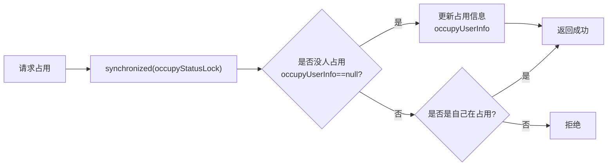
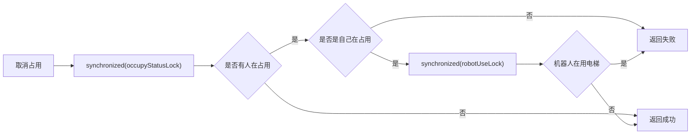
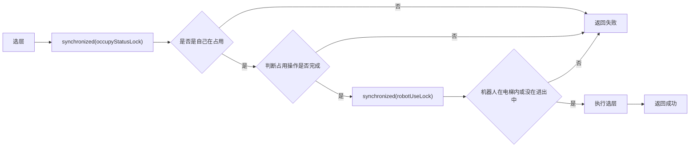
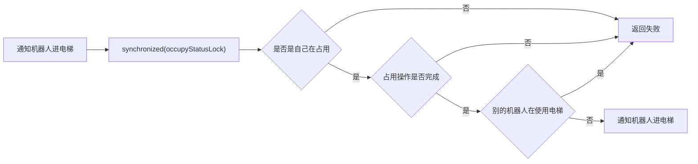
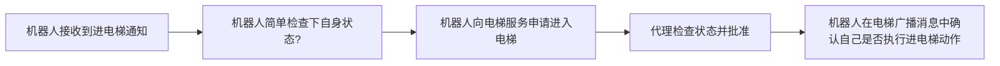

### 手动控电梯逻辑

##### 独占电梯


##### 取消独占


##### 选层


##### 平台通知机器人进电梯


```markdown
1. 平台通知机器人进电梯
2. 代理检查权限(是否占用电梯)
3. 代理检查独占是否完成
4. 代理转发通知给机器人
   
5. 机器人收到后,向代理申请"我要进电梯"
6. 代理检查状态(是否有其他机器人在用)
7. 代理批准并设置状态为"进电梯中"
   
8. 机器人执行进电梯
9. 机器人上报"我已在电梯内"
10. 代理更新状态为"在电梯内"
```


```markdown
1. 平台通知机器人出电梯
2. 代理检查权限(是否占用电梯)
3. 代理检查独占是否完成
4. 代理转发通知给机器人

5. 机器人收到后,向代理申请"我要出电梯"
6. 代理检查状态(机器人是否在电梯内)
7. 设置状态为"出电梯中"
8. 代理批准并通知机器人

9. 机器人执行出电梯
10. 机器人上报"我已完成出电梯"
11. 代理更新状态为"无状态"
```
```markdown
1. 平台通知机器人去候梯点?
2. 代理检查权限(是否占用电梯)
3. 代理检查独占是否完成
4. 代理转发通知给机器人

5. 机器人收到后,向代理申请"我要去候梯点"
6. 代理检查状态(机器人是否在电梯内或进出中)
7. 设置状态为"去候梯点中"
8. 代理批准并通知机器人

9. 机器人执行去候梯点
10. 机器人上报"我已到达候梯点"
11. 代理更新状态为"无状态"
```