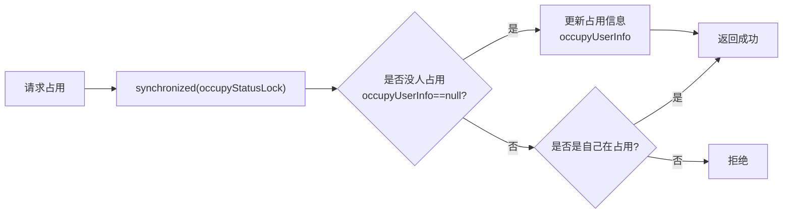
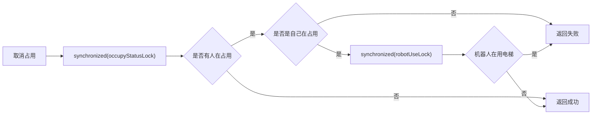
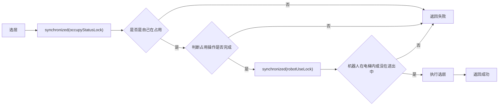
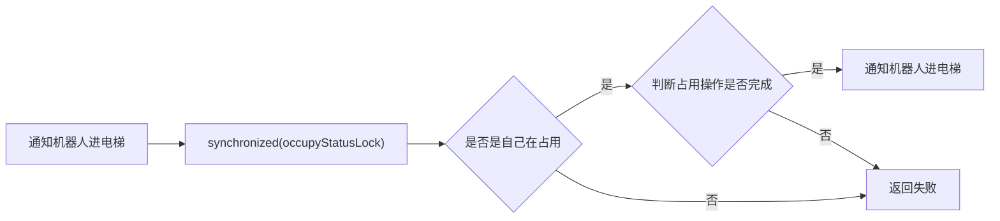
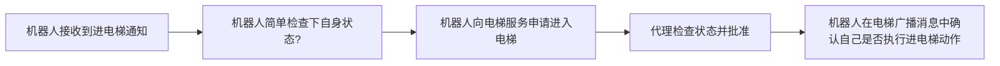

### 手动控电梯逻辑

##### 独占电梯


##### 取消独占


##### 选层


##### 平台通知机器人进电梯


```markdown
1. 平台通知机器人进电梯
2. 代理检查权限(是否占用电梯)
3. 代理检查独占是否完成
4. 代理转发通知给机器人
   
5. 机器人收到后,向代理申请"我要进电梯"
6. 代理检查状态(是否有其他机器人在用)
7. 代理批准并设置状态为"进电梯中"
   
8. 机器人执行进电梯
9. 机器人上报"我已在电梯内"
10. 代理更新状态为"在电梯内"
```


```markdown
1. 平台通知机器人出电梯
2. 代理检查权限(是否占用电梯)
3. 代理检查独占是否完成
4. 代理转发通知给机器人

5. 机器人收到后,向代理申请"我要出电梯"
6. 代理检查状态(机器人是否在电梯内)
7. 设置状态为"出电梯中"
8. 代理批准并通知机器人

9. 机器人执行出电梯
10. 机器人上报"我已完成出电梯"
11. 代理更新状态为"无状态"
```


```markdown
当前手控电梯相关指令流程

1. 占用电梯 
   参数 客户端id 
   客户端发送消息 > 电梯代理服务
   判断电梯是否有人正在占用>
   判断是否是自在占用 是> end
   判断是否有机器人正在电梯内,或进出中 没有>
   可以占用
   
2. 取消占用 
   参数 客户端id 
   客户端发送消息 > 电梯代理服务
   判断电梯是否有人正在占用 没有> end
   判断是否是自在占用 是>
   检查有没有机器人在电梯内或进出中 没有>
   可以取消
   //如果机器人正在使用中 不能取消必须手动控制机器人离开电梯完成 否则可能直接把这个机器人卡在电梯了

3. 选层 
   参数 客户端id 和选择的楼层数 
   客户端发送消息 > 电梯代理服务
   判断是否是自在占用 是>
   判断当前有没有机器人在进出中 没有>
   执行选层

2和3 如果经过机器人确认 等于机器人如果离线 这个电梯就不能用了。
```

```markdown
机器人开始进电梯前跟电梯代理服务通信 更新当前在电梯内的人之后 机器人再更新步骤和状态进行下一步
电梯代理服务知道 当前在进电中的机器人,出电梯中的机器人,在电梯内的机器人

通知机器人进电梯流程 
    参数 客户端id 和 机器人id 
    客户端发送消息 > 电梯代理服务
    判断是否是自己在占用 是>
    判断是否有其他机器人正在电梯内,或进出中 没有>
    判断当前在控的机器人是否不在电梯内 >
    电梯代理标记当前机器人在进入电梯中 电梯代理服务 > 对应机器人
        判断是否是手动模式 如果不是,机器人返回消息给电梯代理 电梯代理清空当前机器人在进电梯标记并返回消息给客户端  如果是手动模式>
            其他原因都失败都应同代理服务取消标志 后返回给客户端
            进入进电梯流程  给电梯代理回消息 电梯代理服务将消息转达给客户端


通知机器人出去电梯流程
    参数 客户端id 和 机器人id
    客户端发送消息 > 电梯代理服务
    判断是否是自己在占用 是>
    判断是否有其他机器人正在电梯内,或进出中 没有>
    判断当前在控的机器人是否在电梯内 >
    电梯代理标记当前机器人在离开电梯中 电梯代理服务 > 对应机器人
        判断是否是手动模式 如果不是,机器人返回消息给电梯代理 电梯代理清空当前机器人在进电梯标记并返回消息给客户端  如果是手动模式>
        其他原因都失败都应同代理服务取消标志 后返回给客户端
        进入出电梯流程  给电梯代理回消息 电梯代理服务将消息转达给客户端


通知机器人去候梯点流程
    参数 客户端id 和 机器人id
    客户端发送消息 > 电梯代理服务
    判断是否有其他机器人正在电梯内,或进出中 没有>
    判断当前机器人是否在电梯内,或进出中>
        是>
            判断是否是自己在占用 是>
            电梯代理服务 > 对应机器人
            判断是否是手动模式 如果不是,机器人返回消息给电梯代理 电梯代理清空当前机器人在进电梯标记并返回消息给客户端  如果是手动模式>
            其他原因都失败都应同代理服务取消标志 后返回给客户端
            进入出电梯流程  给电梯代理回消息 电梯代理服务将消息转达给客户端
        否>
            电梯代理服务 > 对应机器人
            机器人判断是否是手动模式 是手动模式>
            机器人判断自己是否不在候梯点>
            机器人判断自己是否在电梯-候梯点这段距离之外  是则可以直接去候梯点。 如果不是>
            对应机器人 > 电梯代理服务
            判断是否是自在占用 是>
            电梯代理标记当前机器人在离开电梯中 电梯代理服务 > 对应机器人
            判断是否是手动模式 如果不是,机器人返回消息给电梯代理 电梯代理清空当前机器人在进电梯标记并返回消息给客户端  如果是手动模式>
            其他原因都失败都应同代理服务取消标志 后返回给客户端
            进入出电梯流程  给电梯代理回消息 电梯代理服务将消息转达给客户端

    


```
